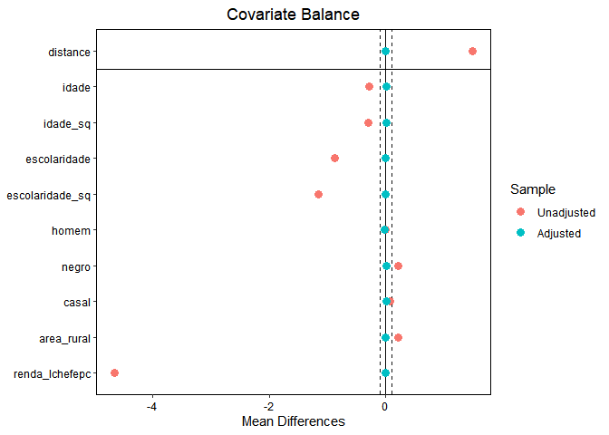
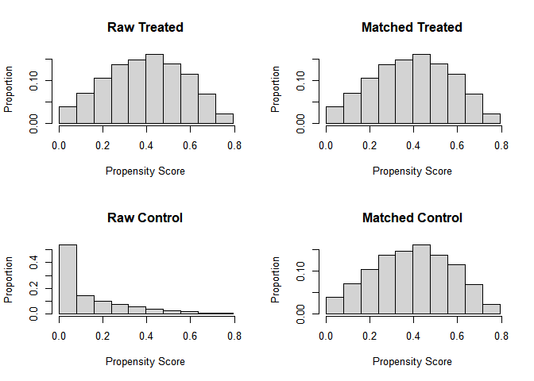

Bolsa Família
================
João Pedro Nogueira
,2025

We want to check if the ***Bolsa Família*** CCT program affects
labor-market outcomes. To do so, we’ll use data from the ***PNAD***,
which is is a survey conducted annually by IBGE since 1981. PNAD
investigates several characteristics of the population such as household
composition, education, labor, income and fertility. Moreover, almost
every year, there is an investigation of an additional topic, such as
education, health, professional training and food security.

Our data is from PNAD’s sample in 2006. The data is available in two
files. The first file, “PES2006.txt”, contains individual-level data,
while the second file, “DOM2006.txt” contains household-level data. To
be able to read these files, we’ll use the Dictionary files that IBGE
provides alongside the data.

``` r
dic_pessoas <- read_xls("2006\\Dicionário\\Dicionário de variáveis de pessoas - 2006.xls",skip=4,col_names = F) %>%
  dplyr::select(c(1,2,3,5)) %>%
  na.omit()
```

    ## New names:
    ## • `` -> `...1`
    ## • `` -> `...2`
    ## • `` -> `...3`
    ## • `` -> `...4`
    ## • `` -> `...5`
    ## • `` -> `...6`
    ## • `` -> `...7`

``` r
names(dic_pessoas) <- c("inicio","tamanho","variavel","descricao") #atribui nomes para as colunas
dic_pessoas$inicio <- as.integer(dic_pessoas$inicio)

posicoes <- fwf_positions(start=dic_pessoas$inicio,end = dic_pessoas$inicio + (dic_pessoas$tamanho - 1), col_names = dic_pessoas$variavel) #Designa as posições de cada variável
df_p <- read_fwf("2006\\Dados\\PES2006.txt",col_positions = posicoes,col_types = cols(.default = "d"))

rm(posicoes)

head(df_p)
```

    ## # A tibble: 6 × 354
    ##   V0101    UF  V0102 V0103 V0301 V0302 V3031 V3032 V3033 V8005 V0401 V0402 V0403
    ##   <dbl> <dbl>  <dbl> <dbl> <dbl> <dbl> <dbl> <dbl> <dbl> <dbl> <dbl> <dbl> <dbl>
    ## 1  2006    11 1.10e7     1     1     2     7    12  1977    28     1     1     1
    ## 2  2006    11 1.10e7     1     2     4     4     2  1982    24     2     2     1
    ## 3  2006    11 1.10e7     1     3     2     5     9  1983    23     4     4     1
    ## 4  2006    11 1.10e7     3     1     2    15     7  1964    42     1     1     1
    ## 5  2006    11 1.10e7     3     2     4    12     6  1969    37     2     2     1
    ## 6  2006    11 1.10e7     3     3     2    27    12  1987    18     3     3     1
    ## # ℹ 341 more variables: V0404 <dbl>, V0405 <dbl>, V0406 <dbl>, V0407 <dbl>,
    ## #   V0408 <dbl>, V0501 <dbl>, V0502 <dbl>, V5030 <dbl>, V0504 <dbl>,
    ## #   V0505 <dbl>, V5061 <dbl>, V5062 <dbl>, V5063 <dbl>, V5064 <dbl>,
    ## #   V5065 <dbl>, V0507 <dbl>, V5080 <dbl>, V5090 <dbl>, V0510 <dbl>,
    ## #   V0511 <dbl>, V5121 <dbl>, V5122 <dbl>, V5123 <dbl>, V5124 <dbl>,
    ## #   V5125 <dbl>, V0601 <dbl>, V0602 <dbl>, V6002 <dbl>, V0603 <dbl>,
    ## #   V0604 <dbl>, V0605 <dbl>, V0606 <dbl>, V0607 <dbl>, V0608 <dbl>, …

``` r
dic_domicilios <- read_xls("2006\\Dicionário\\Dicionário de variáveis de domicílios - 2006.xls",skip=4,col_names = F) %>%
  dplyr::select(c(1,2,3,5)) %>%
  na.omit()
```

    ## New names:
    ## • `` -> `...1`
    ## • `` -> `...2`
    ## • `` -> `...3`
    ## • `` -> `...4`
    ## • `` -> `...5`
    ## • `` -> `...6`
    ## • `` -> `...7`

``` r
names(dic_domicilios) <- c("inicio","tamanho","variavel","descricao")
dic_domicilios$inicio <- as.integer(dic_domicilios$inicio)

posicoes <- fwf_positions(start=dic_domicilios$inicio,end = dic_domicilios$inicio + (dic_domicilios$tamanho - 1), col_names = dic_domicilios$variavel) #Designa as posições de cada variável
df_d <- read_fwf("2006\\Dados\\DOM2006.txt",col_positions = posicoes,col_types = cols(.default = "d"))

rm(posicoes)

head(df_d)
```

    ## # A tibble: 6 × 75
    ##   V0101    UF  V0102 V0103 V0104 V0105 V0106 V0201 V0202 V0203 V0204 V0205 V0206
    ##   <dbl> <dbl>  <dbl> <dbl> <dbl> <dbl> <dbl> <dbl> <dbl> <dbl> <dbl> <dbl> <dbl>
    ## 1  2006    11 1.10e7     1     1     3     3     1     2     2     1     5     2
    ## 2  2006    11 1.10e7     2     6    NA    NA    NA    NA    NA    NA    NA    NA
    ## 3  2006    11 1.10e7     3     1     4     4     1     2     1     1     7     3
    ## 4  2006    11 1.10e7     4     1     6     5     1     2     2     1     5     3
    ## 5  2006    11 1.10e7     5     1     4     2     1     2     2     1     6     2
    ## 6  2006    11 1.10e7     6     1     4     4     1     2     2     1     4     2
    ## # ℹ 62 more variables: V0207 <dbl>, V0208 <dbl>, V2081 <dbl>, V0209 <dbl>,
    ## #   V2091 <dbl>, V0210 <dbl>, V0211 <dbl>, V0212 <dbl>, V0213 <dbl>,
    ## #   V0214 <dbl>, V0215 <dbl>, V0216 <dbl>, V2016 <dbl>, V0217 <dbl>,
    ## #   V0218 <dbl>, V0219 <dbl>, V0220 <dbl>, V2020 <dbl>, V0221 <dbl>,
    ## #   V0222 <dbl>, V0223 <dbl>, V0224 <dbl>, V0225 <dbl>, V0226 <dbl>,
    ## #   V0227 <dbl>, V0228 <dbl>, V0229 <dbl>, V0230 <dbl>, V0231 <dbl>,
    ## #   V0232 <dbl>, V4105 <dbl>, V4106 <dbl>, V4107 <dbl>, V4600 <dbl>, …

We’ve accessed the data, but the variables have very generic names and
it’s hard to understand what each of them represent. So, let’s add
descriptive labels to them. We’ll once again use the data provided in
the Dictionaries.

``` r
library(Hmisc)
```

    ## 
    ## Attaching package: 'Hmisc'

    ## The following objects are masked from 'package:dplyr':
    ## 
    ##     src, summarize

    ## The following objects are masked from 'package:base':
    ## 
    ##     format.pval, units

``` r
lookup <- data.frame(code=dic_pessoas$variavel,label=dic_pessoas$descricao,stringsAsFactors = F)

for (i in 1:length(colnames(df_p))) {
  if(!is.na(match(colnames(df_p),lookup$code)[i])){
    Hmisc::label(df_p[[i]]) <- lookup$label[(match(colnames(df_p),lookup$code))[i]]
  }
}

rm(lookup,i)

lookup <- data.frame(code=dic_domicilios$variavel,label=dic_domicilios$descricao,stringsAsFactors = F)

for (i in 1:length(colnames(df_d))) {
  if(!is.na(match(colnames(df_d),lookup$code)[i])){
    Hmisc::label(df_d[[i]]) <- lookup$label[(match(colnames(df_d),lookup$code))[i]]
  }
}

rm(lookup,i)

#view(df_d)
#view(df_p)
```

Much better now. Let’s merge our data frames. To make things simpler,
we’ll limit our observations only to those in the state of Minas Gerais.

``` r
df <- full_join(df_d,df_p,by = c("V0101","UF","V0102","V0103")) %>%
  dplyr::filter(UF==31)

rm(df_d,df_p)

head(df)
```

    ## # A tibble: 6 × 425
    ##   V0101     UF    V0102    V0103 V0104 V0105 V0106 V0201 V0202 V0203 V0204 V0205
    ##   <labelle> <lab> <labell> <lab> <lab> <lab> <lab> <lab> <lab> <lab> <lab> <lab>
    ## 1 2006      31    31000010 1     1     5     4     1     2     1     1     6    
    ## 2 2006      31    31000010 1     1     5     4     1     2     1     1     6    
    ## 3 2006      31    31000010 1     1     5     4     1     2     1     1     6    
    ## 4 2006      31    31000010 1     1     5     4     1     2     1     1     6    
    ## 5 2006      31    31000010 1     1     5     4     1     2     1     1     6    
    ## 6 2006      31    31000010 2     1     4     4     1     2     1     1     5    
    ## # ℹ 413 more variables: V0206 <labelled>, V0207 <labelled>, V0208 <labelled>,
    ## #   V2081 <labelled>, V0209 <labelled>, V2091 <labelled>, V0210 <labelled>,
    ## #   V0211 <labelled>, V0212 <labelled>, V0213 <labelled>, V0214 <labelled>,
    ## #   V0215 <labelled>, V0216 <labelled>, V2016 <labelled>, V0217 <labelled>,
    ## #   V0218 <labelled>, V0219 <labelled>, V0220 <labelled>, V2020 <labelled>,
    ## #   V0221 <labelled>, V0222 <labelled>, V0223 <labelled>, V0224 <labelled>,
    ## #   V0225 <labelled>, V0226 <labelled>, V0227 <labelled>, V0228 <labelled>, …

Then, we’ll create new variables and modify existing ones, so our
analysis is more precise.

``` r
df <- df %>%
  dplyr::mutate("bolsa_familia"=ifelse(V2403==1,1,0)) %>% #bolsa família dummy
  dplyr::mutate("idade" = ifelse(V8005!=999,V8005,NA)) %>%
  dplyr::mutate("idade_sq" = idade^2) %>%
  dplyr::mutate("escolaridade"=ifelse(V4703!=17,V4703-1,NA)) %>% #years of schooling
  dplyr::mutate("escolaridade_sq"=escolaridade^2) %>%
  dplyr::mutate("homem"=ifelse(V0302==2,1,0)) %>% #male dummy
  dplyr::mutate("negro"=ifelse(V0404==4|V0404==8,1,0)) %>% #black dummy
  dplyr::mutate("casal"=ifelse(V4723==1|V4723==2|V4723==3|V4723==4|V4723==5,1,0)) %>% #married dummy
  dplyr::mutate("trabalha"=ifelse(V9001==1,1,0)) %>% #employed dummy
  dplyr::mutate("area_rural"=ifelse(V4728==4|V4728==5|V4728==6|V4728==7|V4728==8,1,0)) #rural worker dummy

#number of hours worked in the past week
df <- df %>% 
  mutate("horas_trabalhadas" = rowSums(select(., V0713, V9058, V9101, V9105) %>% 
                                 mutate(across(everything(), ~ ifelse(. <= 98, ., 0))), 
                               na.rm = T))

#household income without the head of the household
df <- df %>%
  mutate(
    "rendimento_total" = rowSums(
      select(., V4721, V4719) %>%
        mutate(across(everything(), ~ ifelse(. < 999999999999, ., 0))), 
      na.rm = TRUE
    ),
    "renda_lchefepc" = ifelse(V4741 > 0, rendimento_total / V4741, NA)
  )

#Number of children under/over 14
df <- df %>%
  group_by(V0102, V0103) %>%
  mutate(
    "filhos_menos_14" = sum(V0402 == 3 & idade < 14, na.rm = TRUE),
    "filhos_mais_14" = sum(V0402 == 3 & idade > 14, na.rm = TRUE)
  ) %>%
  ungroup()

#Keep only observations for head of household and spouses
filtered_df <- df %>%
  filter(V0401==1 | V0401==2)
```

Now, let’s start off by running an OLS model, with individuals that
worked more than 0 hours over the past week.

``` r
library(lmtest)
```

    ## Carregando pacotes exigidos: zoo

    ## 
    ## Attaching package: 'zoo'

    ## The following objects are masked from 'package:base':
    ## 
    ##     as.Date, as.Date.numeric

``` r
library(sandwich)
library(texreg)
```

    ## Version:  1.39.4
    ## Date:     2024-07-23
    ## Author:   Philip Leifeld (University of Manchester)
    ## 
    ## Consider submitting praise using the praise or praise_interactive functions.
    ## Please cite the JSS article in your publications -- see citation("texreg").

    ## 
    ## Attaching package: 'texreg'

    ## The following object is masked from 'package:tidyr':
    ## 
    ##     extract

``` r
filtered_df <- filtered_df %>%
  filter(horas_trabalhadas>0)

ols <- lm(horas_trabalhadas ~ bolsa_familia + idade + idade_sq + escolaridade + escolaridade_sq + homem + negro + casal + area_rural + renda_lchefepc, data = filtered_df)

screenreg(coeftest(ols,vcov. = vcovHC(ols,type="HC3")))
```

    ## 
    ## ==========================
    ##                  Model 1  
    ## --------------------------
    ## (Intercept)      22.44 ***
    ##                  (1.46)   
    ## bolsa_familia    -1.72 ***
    ##                  (0.37)   
    ## idade             0.75 ***
    ##                  (0.06)   
    ## idade_sq         -0.01 ***
    ##                  (0.00)   
    ## escolaridade      0.62 ***
    ##                  (0.12)   
    ## escolaridade_sq  -0.04 ***
    ##                  (0.01)   
    ## homem            12.30 ***
    ##                  (0.27)   
    ## negro            -1.26 ***
    ##                  (0.27)   
    ## casal            -1.25 ***
    ##                  (0.37)   
    ## area_rural       -2.85 ***
    ##                  (0.40)   
    ## renda_lchefepc    0.00 ***
    ##                  (0.00)   
    ## ==========================
    ## *** p < 0.001; ** p < 0.01; * p < 0.05

The results seem to indicate that recipients of the Bolsa Família
program work less hours than those that do not participate in the
program. However, the issue is that if Bolsa Família does indeed reduce
the number of hours worked, if we only look at people who have worked
more than zero hours, the effect we are capturing may have been
underestimated, since it is possible that people who previously worked a
few hours now work zero hours. At the same time, if Bolsa Família causes
people who were unemployed to get jobs that consist of fewer hours than
the average, then we would observe a negative effect, when in fact there
is none. The necessary hypothesis for the captured effect to be true is
that Bolsa Família does not affect participation in the labor market
(i.e. it does not cause the unemployed to get jobs and vice versa). If
it does affect participation in the labor market, then it’s possible
that our result is biased due to sample selection issues.

Let’s run the model again, but this time, we’ll keep all household
members.

``` r
df <- df %>%
  dplyr::filter(horas_trabalhadas>0)

ols2 <- lm(horas_trabalhadas ~ bolsa_familia + idade + idade_sq + escolaridade + escolaridade_sq + homem + negro + casal + area_rural + renda_lchefepc, data = df)

screenreg(coeftest(ols2,vcov. = vcovHC(ols2,type="HC3")))
```

    ## 
    ## ==========================
    ##                  Model 1  
    ## --------------------------
    ## (Intercept)      10.34 ***
    ##                  (0.90)   
    ## bolsa_familia    -1.54 ***
    ##                  (0.30)   
    ## idade             1.26 ***
    ##                  (0.04)   
    ## idade_sq         -0.02 ***
    ##                  (0.00)   
    ## escolaridade      0.88 ***
    ##                  (0.10)   
    ## escolaridade_sq  -0.05 ***
    ##                  (0.01)   
    ## homem             9.74 ***
    ##                  (0.22)   
    ## negro            -0.52 *  
    ##                  (0.22)   
    ## casal            -1.06 ***
    ##                  (0.24)   
    ## area_rural       -2.79 ***
    ##                  (0.32)   
    ## renda_lchefepc    0.00 ***
    ##                  (0.00)   
    ## ==========================
    ## *** p < 0.001; ** p < 0.01; * p < 0.05

The coefficient got smaller, but it’s still negative. It’s fair to
assume we still have some sort of selection bias. So, let’s estimate a
Heckman Model, which is designed to correct this type of problem.

``` r
library(sampleSelection)
```

    ## Carregando pacotes exigidos: maxLik

    ## Carregando pacotes exigidos: miscTools

    ## 
    ## Please cite the 'maxLik' package as:
    ## Henningsen, Arne and Toomet, Ott (2011). maxLik: A package for maximum likelihood estimation in R. Computational Statistics 26(3), 443-458. DOI 10.1007/s00180-010-0217-1.
    ## 
    ## If you have questions, suggestions, or comments regarding the 'maxLik' package, please use a forum or 'tracker' at maxLik's R-Forge site:
    ## https://r-forge.r-project.org/projects/maxlik/

``` r
# Equação de seleção (participação no mercado de trabalho)
selection_eq <- trabalha ~ filhos_menos_14 + filhos_mais_14 + idade + idade_sq +
                escolaridade + escolaridade_sq + homem + negro + casal + area_rural +
                renda_lchefepc

# Equação de resultado (horas trabalhadas)
outcome_eq <- horas_trabalhadas ~ bolsa_familia + idade + idade_sq + escolaridade +
               escolaridade_sq + homem + negro + casal + area_rural + renda_lchefepc

heckman_model <- selection(selection_eq, outcome_eq, data = df, method = "2step")

screenreg(heckman_model,digits=3)
```

    ## 
    ## =================================
    ##                     call         
    ## ---------------------------------
    ## S: (Intercept)          0.949 ***
    ##                        (0.113)   
    ## S: filhos_menos_14     -0.032 *  
    ##                        (0.014)   
    ## S: filhos_mais_14       0.040 ** 
    ##                        (0.013)   
    ## S: idade                0.022 ***
    ##                        (0.004)   
    ## S: idade_sq            -0.000 ***
    ##                        (0.000)   
    ## S: escolaridade         0.042 ** 
    ##                        (0.013)   
    ## S: escolaridade_sq      0.001    
    ##                        (0.001)   
    ## S: homem                0.506 ***
    ##                        (0.031)   
    ## S: negro               -0.081 ** 
    ##                        (0.031)   
    ## S: casal               -0.128 ***
    ##                        (0.036)   
    ## S: area_rural          -0.348 ***
    ##                        (0.036)   
    ## S: renda_lchefepc       0.000 ***
    ##                        (0.000)   
    ## O: (Intercept)         22.468 ***
    ##                        (1.309)   
    ## O: bolsa_familia       -1.178 ***
    ##                        (0.283)   
    ## O: idade                0.944 ***
    ##                        (0.046)   
    ## O: idade_sq            -0.010 ***
    ##                        (0.001)   
    ## O: escolaridade         0.197    
    ##                        (0.121)   
    ## O: escolaridade_sq     -0.026 ***
    ##                        (0.007)   
    ## O: homem                6.031 ***
    ##                        (0.351)   
    ## O: negro               -0.066    
    ##                        (0.250)   
    ## O: casal               -0.140    
    ##                        (0.281)   
    ## O: area_rural           0.743    
    ##                        (0.415)   
    ## O: renda_lchefepc       0.000 ** 
    ##                        (0.000)   
    ## invMillsRatio         -20.177 ***
    ##                        (2.260)   
    ## sigma                  16.165    
    ##                                  
    ## rho                    -1.248    
    ##                                  
    ## ---------------------------------
    ## R^2                     0.138    
    ## Adj. R^2                0.137    
    ## Num. obs.           18786        
    ## Censored             1456        
    ## Observed            17330        
    ## =================================
    ## *** p < 0.001; ** p < 0.01; * p < 0.05

Once again, the coefficient is negative. However, note that the Inverse
Mills Ratio suggests that we indeed have sample selection bias in our
model. So, to make sure that our results are reliable, we’ll run a
Propensity Score Matching algorithm to estimate the Average Treatment
Effect on the Treated (ATT).

``` r
library(MatchIt)
library(MatchItSE)

set.seed(231101256)

DF <- df %>% dplyr::select(81,c(426:439)) %>% na.omit()
DF[sapply(DF, is.character)] <- lapply(DF[sapply(DF, is.character)], 
                                       as.factor)

psm <- matchit(bolsa_familia ~ idade + idade_sq + escolaridade + escolaridade_sq + homem + negro + casal + area_rural + renda_lchefepc,data=DF,method="nearest",link="probit",distance="glm",m.order="largest",ratio=5,discard="both",replace=T)

summary(psm)
```

    ## 
    ## Call:
    ## matchit(formula = bolsa_familia ~ idade + idade_sq + escolaridade + 
    ##     escolaridade_sq + homem + negro + casal + area_rural + renda_lchefepc, 
    ##     data = DF, method = "nearest", distance = "glm", link = "probit", 
    ##     discard = "both", replace = T, m.order = "largest", ratio = 5)
    ## 
    ## Summary of Balance for All Data:
    ##                 Means Treated Means Control Std. Mean Diff. Var. Ratio
    ## distance               0.3937        0.1312          1.4858     1.2050
    ## idade                 33.9581       37.9980         -0.2913     0.9070
    ## idade_sq            1345.4463     1655.8976         -0.2984     0.6911
    ## escolaridade           5.1380        8.0238         -0.8713     0.6011
    ## escolaridade_sq       37.3661       82.6328         -1.1574     0.3295
    ## homem                  0.5657        0.5673         -0.0033          .
    ## negro                  0.7043        0.4963          0.4556          .
    ## casal                  0.7965        0.7291          0.1672          .
    ## area_rural             0.3343        0.1290          0.4353          .
    ## renda_lchefepc       236.6542      924.6158         -4.6539     0.0099
    ##                 eCDF Mean eCDF Max
    ## distance           0.3813   0.5784
    ## idade              0.0475   0.1172
    ## idade_sq           0.0475   0.1172
    ## escolaridade       0.1804   0.3140
    ## escolaridade_sq    0.1804   0.3140
    ## homem              0.0016   0.0016
    ## negro              0.2079   0.2079
    ## casal              0.0673   0.0673
    ## area_rural         0.2053   0.2053
    ## renda_lchefepc     0.3018   0.5703
    ## 
    ## Summary of Balance for Matched Data:
    ##                 Means Treated Means Control Std. Mean Diff. Var. Ratio
    ## distance               0.3936        0.3935          0.0001     1.0002
    ## idade                 33.9599       33.9156          0.0032     1.0261
    ## idade_sq            1345.6144     1337.7070          0.0076     0.9667
    ## escolaridade           5.1392        5.1413         -0.0006     0.9860
    ## escolaridade_sq       37.3769       37.5529         -0.0045     0.9420
    ## homem                  0.5656        0.5820         -0.0331          .
    ## negro                  0.7042        0.6997          0.0098          .
    ## casal                  0.7964        0.7940          0.0059          .
    ## area_rural             0.3341        0.3382         -0.0086          .
    ## renda_lchefepc       236.7251      236.9285         -0.0014     0.8822
    ##                 eCDF Mean eCDF Max Std. Pair Dist.
    ## distance           0.0001   0.0037          0.0019
    ## idade              0.0092   0.0380          1.1026
    ## idade_sq           0.0092   0.0380          1.0495
    ## escolaridade       0.0044   0.0162          1.0376
    ## escolaridade_sq    0.0044   0.0162          0.9419
    ## homem              0.0164   0.0164          0.9928
    ## negro              0.0045   0.0045          0.8525
    ## casal              0.0024   0.0024          0.7948
    ## area_rural         0.0041   0.0041          0.7626
    ## renda_lchefepc     0.0100   0.0651          0.4836
    ## 
    ## Sample Sizes:
    ##                Control Treated
    ## All           15443.      3341
    ## Matched (ESS)  2936.92    3340
    ## Matched        5583.      3340
    ## Unmatched      8006.         0
    ## Discarded      1854.         1

``` r
matched_data <- match.data(psm)

att_value <- att(psm,DF$trabalha)
se_value <- abadie_imbens_se(psm,DF$trabalha)
t_stat <- att_value/se_value
p_val <- 2*pt(-abs(t_stat), df=length(psm)-1)

cbind(att_value,se_value,p_val)
```

    ##       att_value    se_value      p_val
    ## [1,] 0.01826347 0.008074937 0.04722806

Our ATT is 0.018. Assuming that, conditional on the covariates included
in the matching model, treatment assignment is independent of potential
outcomes, and that there is overlap between treated and controls, we can
conclude that this result is valid.

``` r
#Checking if Matching worked

library(cobalt)
```

    ##  cobalt (Version 4.5.5, Build Date: 2024-04-02)

    ## 
    ## Attaching package: 'cobalt'

    ## The following object is masked from 'package:MatchIt':
    ## 
    ##     lalonde

``` r
summary_match <- summary(psm,un=T)
print(summary_match)
```

    ## 
    ## Call:
    ## matchit(formula = bolsa_familia ~ idade + idade_sq + escolaridade + 
    ##     escolaridade_sq + homem + negro + casal + area_rural + renda_lchefepc, 
    ##     data = DF, method = "nearest", distance = "glm", link = "probit", 
    ##     discard = "both", replace = T, m.order = "largest", ratio = 5)
    ## 
    ## Summary of Balance for All Data:
    ##                 Means Treated Means Control Std. Mean Diff. Var. Ratio
    ## distance               0.3937        0.1312          1.4858     1.2050
    ## idade                 33.9581       37.9980         -0.2913     0.9070
    ## idade_sq            1345.4463     1655.8976         -0.2984     0.6911
    ## escolaridade           5.1380        8.0238         -0.8713     0.6011
    ## escolaridade_sq       37.3661       82.6328         -1.1574     0.3295
    ## homem                  0.5657        0.5673         -0.0033          .
    ## negro                  0.7043        0.4963          0.4556          .
    ## casal                  0.7965        0.7291          0.1672          .
    ## area_rural             0.3343        0.1290          0.4353          .
    ## renda_lchefepc       236.6542      924.6158         -4.6539     0.0099
    ##                 eCDF Mean eCDF Max
    ## distance           0.3813   0.5784
    ## idade              0.0475   0.1172
    ## idade_sq           0.0475   0.1172
    ## escolaridade       0.1804   0.3140
    ## escolaridade_sq    0.1804   0.3140
    ## homem              0.0016   0.0016
    ## negro              0.2079   0.2079
    ## casal              0.0673   0.0673
    ## area_rural         0.2053   0.2053
    ## renda_lchefepc     0.3018   0.5703
    ## 
    ## Summary of Balance for Matched Data:
    ##                 Means Treated Means Control Std. Mean Diff. Var. Ratio
    ## distance               0.3936        0.3935          0.0001     1.0002
    ## idade                 33.9599       33.9156          0.0032     1.0261
    ## idade_sq            1345.6144     1337.7070          0.0076     0.9667
    ## escolaridade           5.1392        5.1413         -0.0006     0.9860
    ## escolaridade_sq       37.3769       37.5529         -0.0045     0.9420
    ## homem                  0.5656        0.5820         -0.0331          .
    ## negro                  0.7042        0.6997          0.0098          .
    ## casal                  0.7964        0.7940          0.0059          .
    ## area_rural             0.3341        0.3382         -0.0086          .
    ## renda_lchefepc       236.7251      236.9285         -0.0014     0.8822
    ##                 eCDF Mean eCDF Max Std. Pair Dist.
    ## distance           0.0001   0.0037          0.0019
    ## idade              0.0092   0.0380          1.1026
    ## idade_sq           0.0092   0.0380          1.0495
    ## escolaridade       0.0044   0.0162          1.0376
    ## escolaridade_sq    0.0044   0.0162          0.9419
    ## homem              0.0164   0.0164          0.9928
    ## negro              0.0045   0.0045          0.8525
    ## casal              0.0024   0.0024          0.7948
    ## area_rural         0.0041   0.0041          0.7626
    ## renda_lchefepc     0.0100   0.0651          0.4836
    ## 
    ## Sample Sizes:
    ##                Control Treated
    ## All           15443.      3341
    ## Matched (ESS)  2936.92    3340
    ## Matched        5583.      3340
    ## Unmatched      8006.         0
    ## Discarded      1854.         1

``` r
love.plot(
  psm,
  stats = "mean.diffs",   # Mostrar diferenças de médias padronizadas
  threshold = 0.1         # Limite para diferenças aceitáveis (geralmente 0.1)
)
```

    ## Warning: Standardized mean differences and raw mean differences are present in the same plot. 
    ## Use the `stars` argument to distinguish between them and appropriately label the x-axis.

<!-- -->

``` r
plot(psm, type = "hist", which.xs = NULL)
```

<!-- -->
